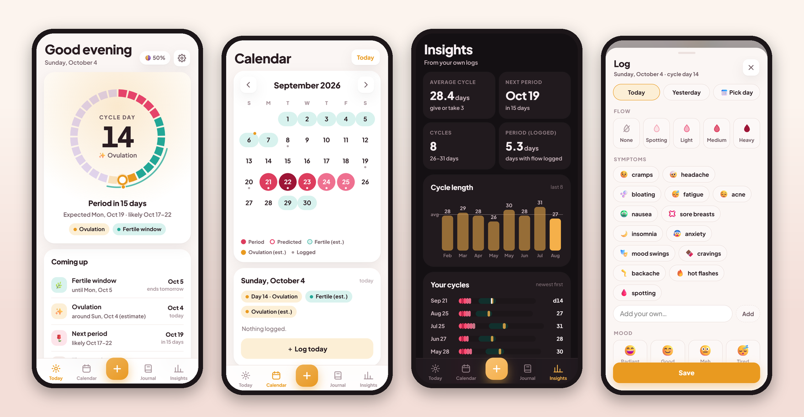
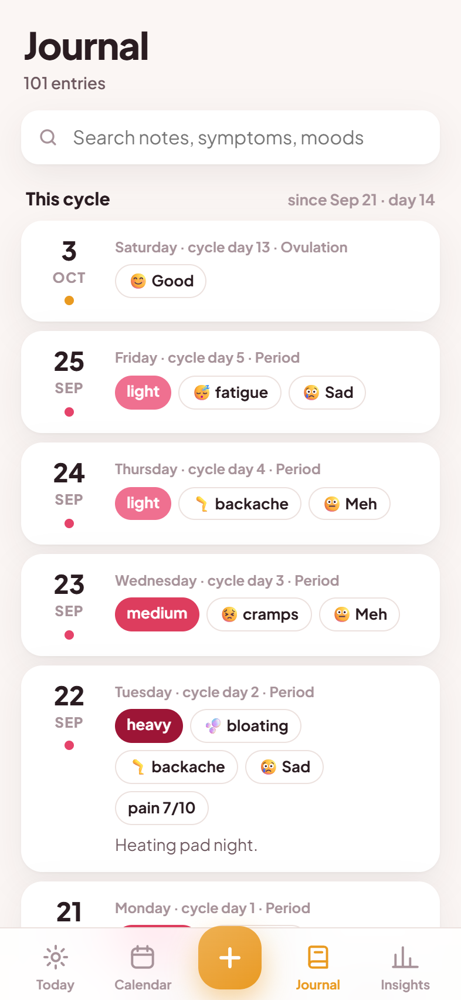
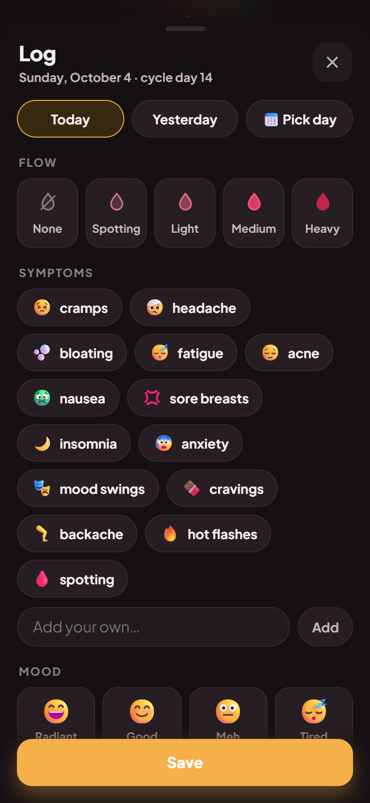
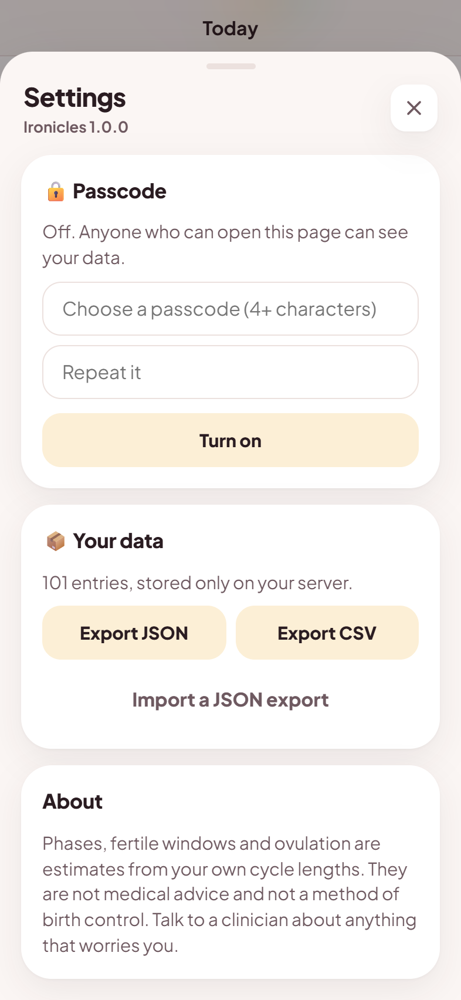

# Ironicles

**A private, self-hosted period and cycle tracker that feels like a phone app.**



Your data lives in one SQLite file on your own server. There are no accounts, no analytics and no
cloud, and the app makes no third-party requests (even the font is bundled). Lock it with a passcode
if you like.

<table>
<tr>
<td align="center"><br><sub><b>Today</b></sub></td>
<td align="center"><br><sub><b>Calendar</b></sub></td>
<td align="center"><br><sub><b>Journal</b></sub></td>
<td align="center"><br><sub><b>Insights</b></sub></td>
</tr>
<tr>
<td align="center"><br><sub>Today, dark</sub></td>
<td align="center"><br><sub>Calendar, dark</sub></td>
<td align="center"><br><sub>Journal, dark</sub></td>
<td align="center"><br><sub>Insights, dark</sub></td>
</tr>
<tr>
<td align="center"><br><sub><b>Log</b></sub></td>
<td align="center"><br><sub>Log, dark</sub></td>
<td align="center"><br><sub><b>Settings</b></sub></td>
<td align="center"><br><sub><b>Passcode lock</b></sub></td>
</tr>
</table>

<sub>Screenshots use made-up demo data from <code>tools/seed_demo.py</code>.</sub>

## What it does

- **Today.** A ring showing the whole cycle (period, follicular, ovulation, luteal), the fertile window
  and where you are. When the next period is due, with a *likely* range drawn from your own
  cycle-to-cycle variation. What's coming up, one-tap logging (tap again to take it back, with Undo),
  and tips for the phase you're in. The whole theme tints to the current phase.
- **Calendar.** Swipe between months to see logged flow by intensity, predicted periods, and estimated
  fertile windows and ovulation. Tap a day for its cycle day, phase and entries.
- **Journal.** Every entry and note, grouped by cycle and searchable.
- **Insights.** Cycle length over time, a timeline of past cycles, where in the cycle each symptom and
  mood tends to show up, pain by phase, and (for fun) the moon phase at each period start.
- **Logging.** One sheet for the date, flow, symptoms (presets plus your own words), mood, pain from 0
  to 10, and notes. Edit or delete any entry, with Undo.
- **Feels like an app.** Add it to your home screen. Dark mode, smooth transitions, sheets you drag down
  to close, a back gesture that closes a sheet instead of leaving the app, and pull to refresh.
- **Yours.** An optional passcode, export to JSON or CSV, and import from a JSON export.

> **Estimates only.** Phases, fertile windows and ovulation are estimated from your logged cycle
> lengths. Ironicles is not medical advice and **not a method of birth control**.

## Quick start

```sh
git clone https://github.com/chungus-actual/ironicles.git && cd ironicles
docker compose up -d --build
```

Open `http://<host>:8889` on your phone, log the first day of a period, and add it to the home screen
(Safari: Share → Add to Home Screen. Chrome: ⋮ → Add to Home screen).

Want to look around first? Seed some made-up data into a separate file:

```sh
python tools/seed_demo.py --db data/demo.db
cd backend && IRONICLES_DB=../data/demo.db uvicorn main:app --port 8889
```

## Privacy and the passcode

- Turn on a passcode in **Settings** (the gear on Today). Each device unlocks once and stays unlocked
  for 180 days, and changing the passcode signs every other device out. Wrong guesses are rate-limited.
  The passcode is stored as a salted PBKDF2 hash.
- With a passcode on, nothing is cached on the phone where the lock couldn't protect it, and the service
  worker only ever caches the app itself, never your data.
- Prefer configuration to clicking? `IRONICLES_PASSCODE` pins the passcode, and Settings then shows it as
  set by the server.
- Put it behind HTTPS (any reverse proxy) if it's reachable from outside your home network. HTTPS also
  enables offline start and the install prompt on Android. On plain HTTP everything else still works.
- **Back up** the `data/` folder, or use **Settings → Export**.

## Configuration

| Variable | Default | |
|---|---|---|
| `IRONICLES_DB` | `data/ironicles.db` (`/data/ironicles.db` in Docker) | The SQLite file |
| `IRONICLES_PASSCODE` | none | Pin a passcode (otherwise set one in the app, or don't) |
| `IRONICLES_SESSION_DAYS` | `180` | How long an unlocked device stays unlocked |
| `TZ` | `UTC` | Server timezone. "Today" comes from the phone, so this only affects logs |

Without Docker:

```sh
python3 -m venv .venv && .venv/bin/pip install -r backend/requirements.txt
cd backend && ../.venv/bin/uvicorn main:app --host 0.0.0.0 --port 8889
```

## How the estimates work

- **Period start.** A day with light, medium or heavy flow after two or more days without one. Days you
  didn't log count as days without flow, so sparse logging works.
- **Next period.** The last start plus the median of your last six cycle lengths (28 days until there
  are two starts). The *likely* range runs from the shortest to the longest of those six.
- **Phases.** With cycle length *L* and ovulation day *O* = max(8, *L* − 14): period on days 1–5,
  follicular until *O* − 2, ovulation from *O* − 1 to *O* + 1, luteal after that, and **late** once
  you're past the expected length. Fertile window: max(6, *O* − 5) to *O* + 1.

## API

Everything the app does is plain JSON, so other tools (Home Assistant, scripts, chat bots) can read and
log too. Writes need the header `X-Ironicles: 1`. With a passcode on, every call needs the session cookie
from `POST /api/login`.

| Endpoint | |
|---|---|
| `GET /api/state?today=YYYY-MM-DD` | Everything the app draws, in one call |
| `GET /api/today` · `GET /api/summary?days=` · `GET /api/entries?limit=&offset=` | Pieces of the above |
| `POST /api/log` | `{date?, flow?, symptoms?, mood?, notes?, extras?: {pain}}` |
| `PUT /api/entries/{id}` · `DELETE /api/entries/{id}` | Edit or delete |
| `GET /api/export?format=json\|csv` · `POST /api/import` | Your data out and back in |
| `GET /api/auth` · `POST /api/login` · `POST /api/logout` · `POST /api/settings/passcode` | Passcode |

Flows are `none`, `spotting`, `light`, `medium` and `heavy`. Symptoms and moods are free text, and the
app offers presets.

## Development

```sh
pip install -r requirements-dev.txt
python tests/test_api.py
```

The backend is FastAPI (`backend/main.py`) and the app is plain HTML, CSS and JS (`backend/static/`)
with no build step.

## License

MIT, see `LICENSE`. Bundles Plus Jakarta Sans (SIL OFL 1.1), see `THIRD_PARTY_NOTICES`.
