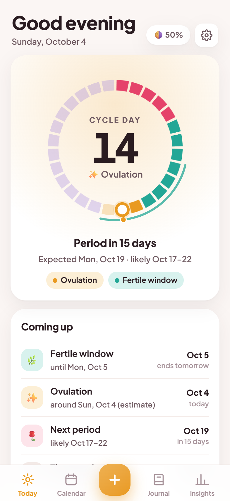
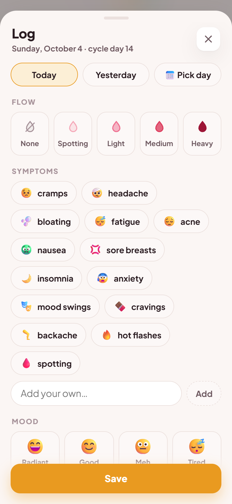
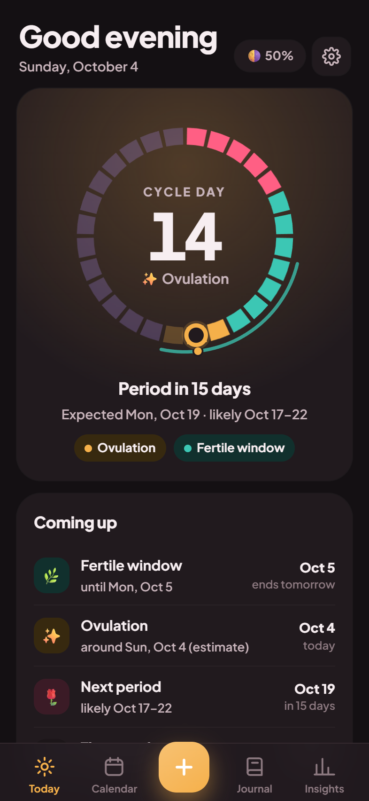
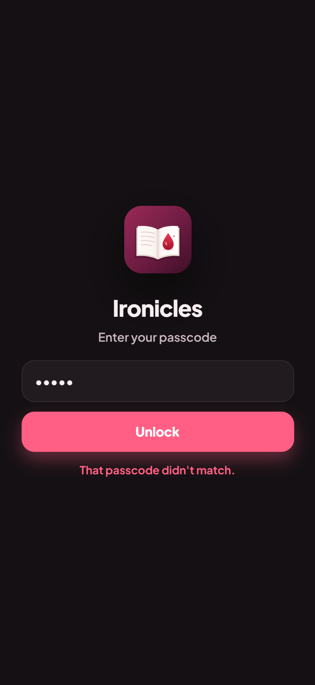

# Ironicles

A private, self-hosted period and cycle tracker that works like a phone app.

Your data lives in one SQLite file on your own server. The app makes no third-party requests
(the font is bundled), has no accounts, no analytics and no cloud — and can be locked with a
passcode.

| Today | Calendar | Insights | Log |
|---|---|---|---|
|  |  |  |  |
|  |  |  |  |

<sub>Screenshots use made-up demo data (`tools/seed_demo.py`).</sub>

## What it does

- **Today** — a ring showing the whole cycle (period, follicular, ovulation, luteal), the fertile
  window and where you are; when the next period is due, with a *likely* range from your own
  cycle-to-cycle variation; what's coming up; one-tap logging (tap again to take it back, with
  Undo); tips for the phase you're in. The whole theme tints to the current phase.
- **Calendar** — swipe between months: logged flow by intensity, predicted periods, estimated
  fertile windows and ovulation; tap a day for its cycle day, phase and entries.
- **Journal** — every entry and note, grouped by cycle, searchable.
- **Insights** — cycle length over time, a timeline of past cycles, where in the cycle each
  symptom and mood tends to show up, pain by phase, and (for fun) the moon phase at each period start.
- **Logging** — one sheet: date, flow, symptoms (presets plus your own words), mood, pain 0–10,
  notes. Edit or delete any entry, with Undo.
- **Feels like an app** — add it to your home screen; dark mode; smooth transitions; sheets you
  drag down to close; the back gesture closes a sheet instead of leaving the app; pull to refresh.
- **Yours** — optional passcode, export to JSON/CSV, import a JSON export.

> **Estimates only.** Phases, fertile windows and ovulation are estimated from your logged cycle
> lengths. Ironicles is not medical advice and **not a method of birth control**.

## Quick start

```sh
git clone https://github.com/chungus-actual/ironicles.git && cd ironicles
docker compose up -d --build
```

Open `http://<host>:8889` on your phone, log the first day of a period, and add it to the home
screen (Safari: Share → Add to Home Screen · Chrome: ⋮ → Add to Home screen).

Want to look around first? Seed some made-up data into a separate file:

```sh
python tools/seed_demo.py --db data/demo.db
cd backend && IRONICLES_DB=../data/demo.db uvicorn main:app --port 8889
```

## Privacy and the passcode

- Turn on a passcode in **Settings** (the gear on Today). Each device unlocks once and stays
  unlocked for 180 days; changing the passcode signs every other device out. Wrong guesses are
  rate-limited. The passcode is stored as a salted PBKDF2 hash.
- With a passcode on, nothing is cached on the phone where the lock couldn't protect it, and the
  service worker never caches your data — only the app itself.
- Prefer configuration to clicking? `IRONICLES_PASSCODE` pins the passcode (Settings then shows
  it as set by the server).
- Put it behind HTTPS (any reverse proxy) if it's reachable from outside your home network.
  HTTPS also enables offline start and the install prompt on Android; on plain HTTP everything
  else still works.
- **Back up** the `data/` folder — or use **Settings → Export**.

## Configuration

| Variable | Default | |
|---|---|---|
| `IRONICLES_DB` | `data/ironicles.db` (`/data/ironicles.db` in Docker) | The SQLite file |
| `IRONICLES_PASSCODE` | — | Pin a passcode (otherwise set it in the app, or don't) |
| `IRONICLES_SESSION_DAYS` | `180` | How long an unlocked device stays unlocked |
| `TZ` | `UTC` | Server timezone. "Today" comes from the phone, so this only affects logs |

Without Docker:

```sh
python3 -m venv .venv && .venv/bin/pip install -r backend/requirements.txt
cd backend && ../.venv/bin/uvicorn main:app --host 0.0.0.0 --port 8889
```

## How the estimates work

- **Period start** — a day with light, medium or heavy flow after two or more days without one
  (days you didn't log count as days without flow, so sparse logging works).
- **Next period** — the last start plus the median of your last six cycle lengths (28 days until
  there are two starts). The *likely* range is the shortest to the longest of those six.
- **Phases** — with cycle length *L* and ovulation day *O* = max(8, *L* − 14): period days 1–5,
  follicular until *O* − 2, ovulation *O* − 1 to *O* + 1, luteal after that, **late** once you're
  past the expected length. Fertile window: max(6, *O* − 5) to *O* + 1.

## API

Everything the app does is plain JSON, so other tools (Home Assistant, scripts, chat bots) can
read and log too. Writes need the header `X-Ironicles: 1`; with a passcode on, every call needs
the session cookie from `POST /api/login`.

| Endpoint | |
|---|---|
| `GET /api/state?today=YYYY-MM-DD` | Everything the app draws, in one call |
| `GET /api/today` · `GET /api/summary?days=` · `GET /api/entries?limit=&offset=` | Pieces of the above |
| `POST /api/log` | `{date?, flow?, symptoms?, mood?, notes?, extras?: {pain}}` |
| `PUT /api/entries/{id}` · `DELETE /api/entries/{id}` | Edit / delete |
| `GET /api/export?format=json\|csv` · `POST /api/import` | Your data out and back in |
| `GET /api/auth` · `POST /api/login` · `POST /api/logout` · `POST /api/settings/passcode` | Passcode |

Flows: `none`, `spotting`, `light`, `medium`, `heavy`. Symptoms and moods are free text; the app
offers presets.

## Development

```sh
pip install -r requirements-dev.txt
python tests/test_api.py
```

Backend: FastAPI (`backend/main.py`). App: plain HTML/CSS/JS (`backend/static/`), no build step.

## License

MIT — see `LICENSE`. Bundles Plus Jakarta Sans (SIL OFL 1.1) — see `THIRD_PARTY_NOTICES`.
